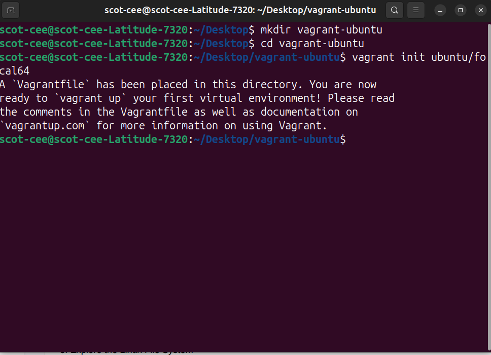
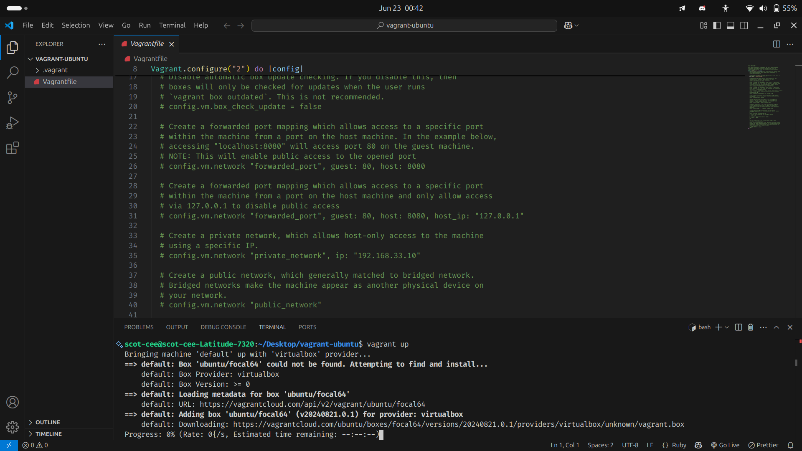
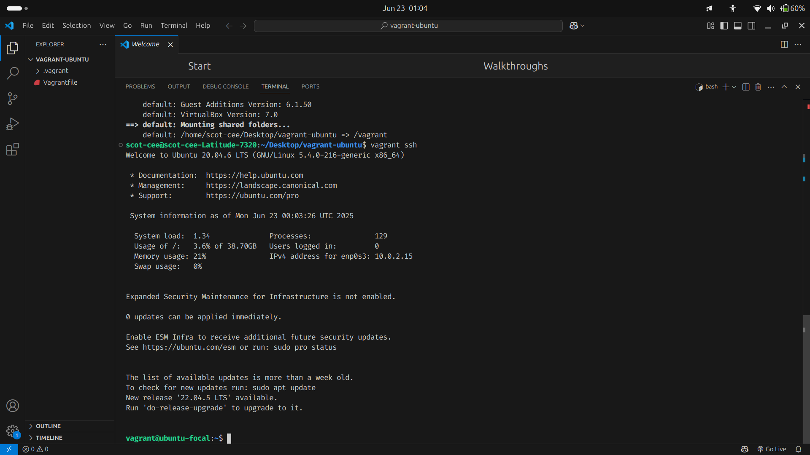
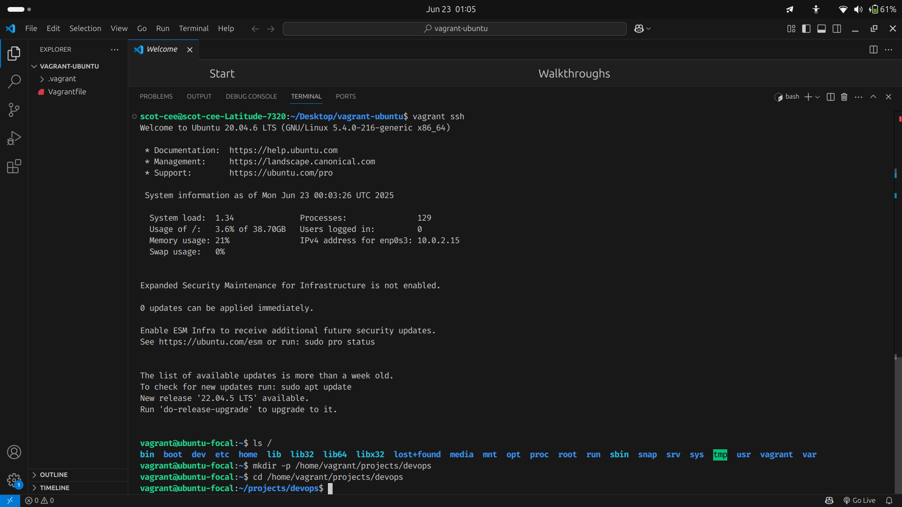
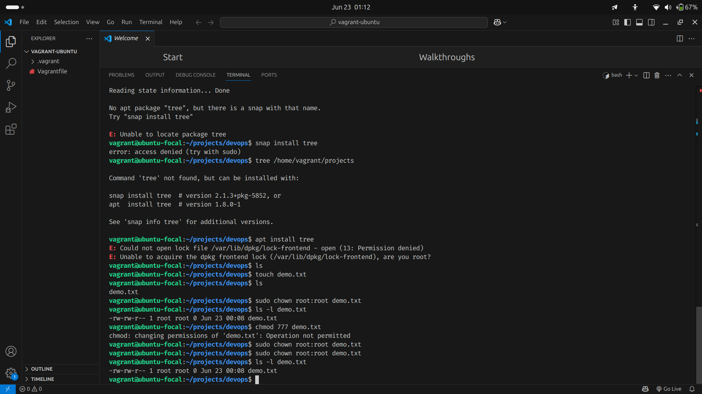
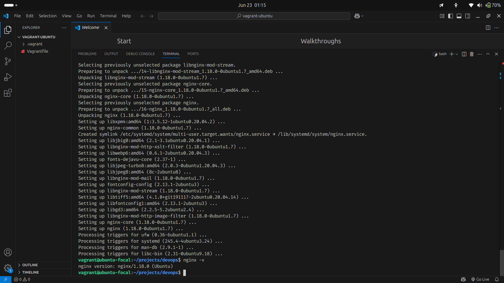
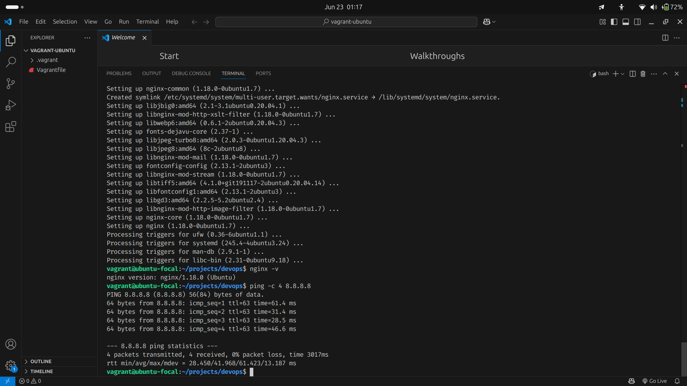

# linux-fundamentals-vagrant
## Task 1: Vagrant Initialization and Login
1 
 I initialized the Vagrant machine using `vagrant init` 

I logged in using `vagrant ssh`

2 
I created a file path using mkdir "/home/vagrant/project/devops"

3 
I created a file `demo.txt` using `touch` 
I changed file permissions using `chmod 777 demo.txt` and ownership using `chown root:root demo.txt`.  
`rwxr-xr-x` means the owner can read/write/execute, group can read/execute, others can read/execute.

4 
I installed an app{nginx} with `sudo apt install`  also checked the version with `nginx -v`

5 
I made  use of `ping -c 4 8.8.8.8 ` to confirm network connectivity. The response time shows the VM is connected to the internet.
